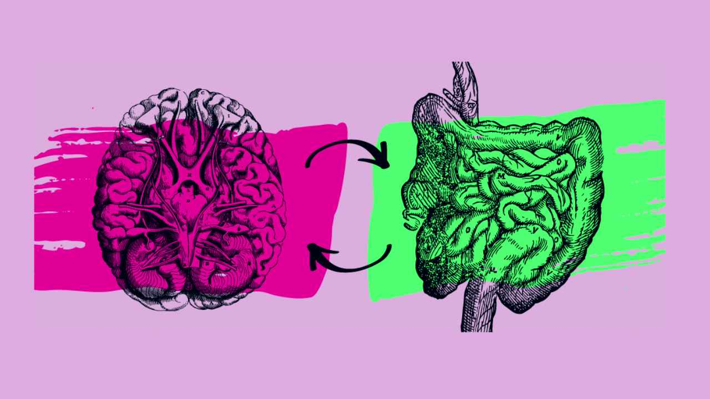

```{r setup, include=FALSE}
knitr::opts_chunk$set(echo = FALSE)
```


## Summary 
Scientists have found plasma cells in the meninges (the membranes that surround the brain and spinal cord) which are trained in the gut to react to pathogens located in the brain by releasing antibodies.

## Source of the article with publication date and word count :
[Source of the article](https://www.sciencenews.org/article/brain-infection-gut-immune-system). Published on  November 11, 2020 and accessed on November 30, 2020

Word count : 667

## Vocabulary: 

| Word from the text | Synonym/definition in English | French translation |
|--------------------|-------------------------------|--------------------|
| to launch          | to begin                      | lancer             |
| a mesh             | a net                         | maillage           |
| paradigm           |  vision                       | paradigme          |
| cues               | clues, indications            | indices              |


## Analysis table

- Researchers? 
    + Menna Clatworthy and her team at the University of Cambridge.

- Published in? when (if mentioned)?
    + Nature on the  4 November

- General topic
    + The plasma cells located in the brain have probably begun their journey in the gut. It makes sense as most of brain pathogens come from the intestine through the blood vessels. Thus, plasma cells need to be educated to respond to gut microbes.
- Procedure/what was examined
    + In germ-free mice, mice that has no microbes in the gut, scientists did not find any plasma cell in the meninges. But as they transferred a bacteria found in feces of others mice or humans into mice's guts, their intestine microbiomes were restored and plasma cell were present in the brain.
    + They also observed the plasma cells immune respond to pathogenic fungi usually found in the intestine. As it tried to enter through the blood vessels of the brain, the plasma cells started producing IgA (immunoglobuline A) antibodies to form a mesh that prevent the fungi from entering.
    
- Conclusions/ discovery
    + Our intestine microbiome is probably involved in our brain immune respond and also in brain diseases

- Remaining questions ? 
    + What are the indications that the plasma cells follow to know when it's time to migrate from the gut to the meninges ?

