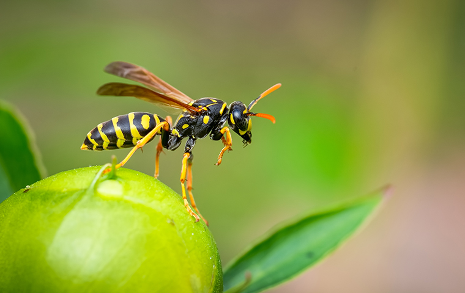

```{r setup, include=FALSE}
knitr::opts_chunk$set(echo = FALSE)
```


## Summary 
Scientists found out that some polypeptides toxin from wasp venom could be very useful to struggle against bacteria. They modified it to make it more efficient and less dangerous for humans.


## Source of the article with publication date and word count :
[Source of the article](https://www.genengnews.com/topics/drug-discovery/wasp-venom-used-to-potentially-combat-antibiotic-resistant-bacteria/).
Published on  October 14, 2020 and accessed on November 24, 2020

Word count : 627

## Vocabulary: 
| Word from the text | Synonym/definition in English               | French translation |
|--------------------|---------------------------------------------|--------------------|
| wasp               | insect with a black and yellow striped body | guêpe              |
| potent             | powerful, strong                            | puissant           |
| immunomodulatory   | which modulates the immune reaction         | immunomodulatoire  |
| untapped           | not being made use of                       | inexploité         |
| to hone            | To perfect or make more effective           | perfectionner      |
| prey               | an animal hunted to be eaten                | proie              |
| to harness         | to use                                      | exploiter          |
|                    |                                             |                    |
|                    |                                             |                    |

## Analysis table

- Researchers? 
    + Researchers from the Perelman School of Medicine at the University of Pennsylvania 

- Published in? when (if mentioned)?
    + PNAS (12/10/20)  

- General topic
    + Utility of a peptid toxin contained in wasp venom to fight antibiotic resistant bacteria and how scientists enhance it to be more effective
- Procedure/what was examined
    + Researchers extracted a peptide called mastoparan-L from *Vespula lewisii* wasps venom. After multiple researches in a data base, they found a pentapeptide motif which as a powerful activity against bacteria and they replaced the toxic part of mast-L with it. The new formed molecule is called mastoparan-MO. They tested it in mice which were infected with a lethal form of E. coli, 80% survived while mice treated with mast-L were more likely to die and at a higher dose of mast-L, have severe sides effects.
    
- Conclusions/ discovery
    + In mice, this engineered molecule has a antimicrobial effect and is safe to use even at high doses. They also concluded that the procedure used could be very useful to inspire other treatments with an antimicrobial and immune-modulating activities.
- Remaining questions ? 
    + Not mentioned in this article but I guess that the remaining question is  : "Is it going to be effective for humans? "


