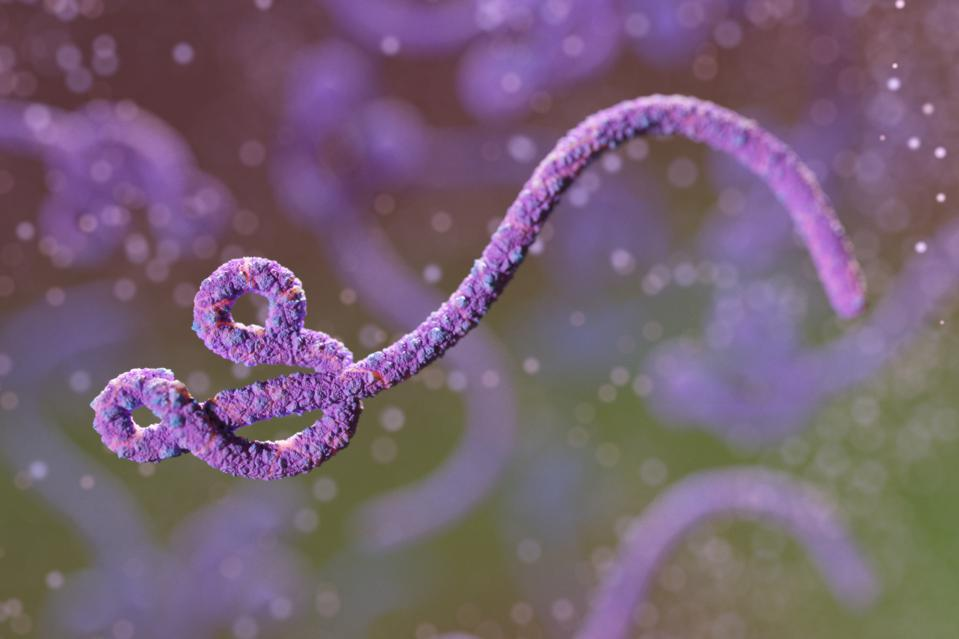

```{r setup, include=FALSE}
knitr::opts_chunk$set(echo = FALSE)
```

## Source of the article with publication date and word count :
[Source of the article](https://www.genengnews.com/topics/drug-discovery/small-molecules-target-entry-mechanism-for-deadly-viruses/).
Published on  February 9, 2021 and accessed on March 12, 2020

Word count : 552

## Vocabulary: 
| Word from the text | Synonym/definition in English | French translation |
|--------------------|-------------------------------|--------------------|
| Uncover            | discover                      | découvrir          |
|                    |                               |                    |
|                    |                               |                    |
|                    |                               |                    |


## Analysis table

- Researchers? 
    + University of Illinois Chicago  Lijun Rong:
- Published in? when (if mentioned)?
    + PLOS Pathogens (04/02/21)
- General topic
    +Scientists discovered in filovirus a second specific glycoprotein site where small molecules can bind and thus prevent the virus from infecting cells
- Procedure/what was examined
    + They observed the interactions between different drugs and the virus with various techniques : molecular, biophysical, and structural
- Conclusions/ discovery
    + They found out several drugs binds to a specific glycoprotein site of virus necessary to infect the cells. They observed a specific binding site for Ebolavirus, an other one for Marburgvirus which is also present in Ebolavirus and they also found out that by trapping the drug in a lysosome helps the viral inhibition. As there is already an other site where molecules can bind, we could use drugs that recognized both site to lower the doses and reducing the chance of mutations. 
- Remaining questions ? 
    + /
