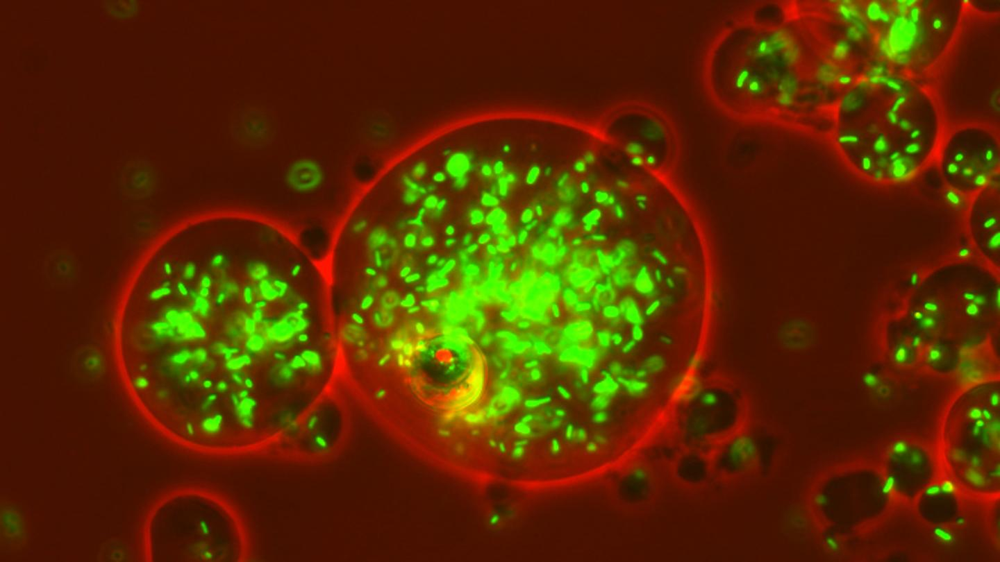

```{r setup, include=FALSE}
knitr::opts_chunk$set(echo = FALSE)
```

## Source of the article with publication date and word count :
[Source of the article](https://www.genengnews.com/news/doppler-used-in-novel-microbial-assay-to-tell-a-friend-from-a-foe/).
Published on  March 2, 2021 and accessed on March 12, 2020

Word count : 679

## Vocabulary: 
| Word from the text | Synonym/definition in English | French translation |
|--------------------|-------------------------------|--------------------|
| Foe                | enemy                         | ennemi             |
| pitch              | tone                          | ton                |
| to zoom            | to move fast                  | rouler vite        |
| strain             | variant                       | souche             |
| to home in         | to go towards                 | se diriger vers    |
|                    |                               |                    |


## Analysis table

- Researchers? 
    + Purdue University : David Nolte, John Turek, Eduardo Ximenes, Michael Ladisch
- Published in? when (if mentioned)?
    + Communications Biology (10/02/2021)
- General topic
    +Scientists used the Doppler effect to identify if a microorganism is pathogenic or not
- Procedure/what was examined
    + They put immortalized cell lines in presence of different bacteria such as *Salmonella* and *E. coli* and used the Doppler effect to observe the reaction of the cells. They did in vitro tissue cultures and noticed that cells acted to protect the tissue against the pathogen. If there is a significant change in the Doppler signal, that means that the microbe is pathogenic otherwise it is harmless. This technology can be used to detect which antibiotic is needed in case of sepsis. If we see a change in the doppler signal in the infected tissue, this means the antibiotic is working, 
- Conclusions/ discovery
    + This technique is faster than usual techniques and could help in diagnosis and treatment of infections
- Remaining questions ? 
    + Would this method work on nonliving pathogenic cells or dried spores? Method still needs to be tested for viral sepsis

